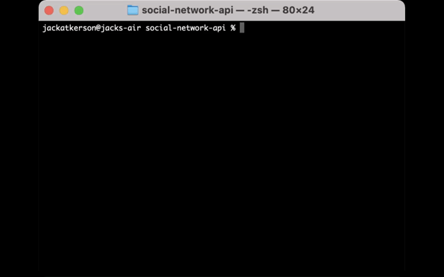

# Challenge 18: Social Network API

## Description
A social network API created using MongoDB and Mongoose. This API allows users to create profiles, add and remove friends, share their thoughts, and react to the thoughts of others.

## Table of Contents
- [Demonstration](#demonstration)
- [Installation](#installation)
- [Usage](#usage)
- [Credits](#credits)
- [Questions](#questions)

## User Story

```
AS A social media startup
I WANT an API for my social network that uses a NoSQL database
SO THAT my website can handle large amounts of unstructured data
```

## Demonstration
Gif demonstrating how to initiate the application:


Gifs demonstrating route functionality:


## Installation
To install this application, clone the repository. Then, go to the root of the project in the command line and run "npm init". Then run ```npm install express mongoose moment```.

## Usage
Log in to the MySQL shell, then run the command ```npm start``` to start the server.

## Credits
Made by Jack Atkerson

## Questions
Feel free to reach out to me at:
[E-Mail](mailto:jatkerson18@gmail.com),
[GitHub](https://github.com/JackAtkerson)